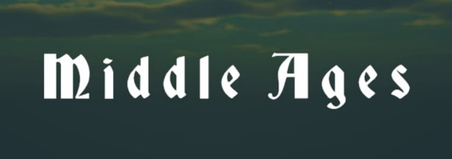
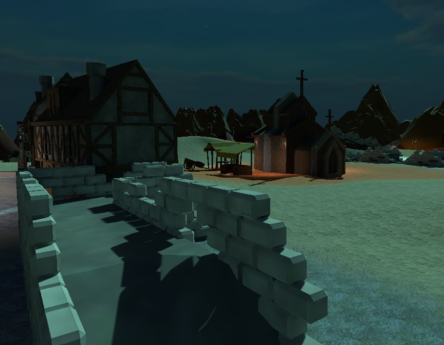
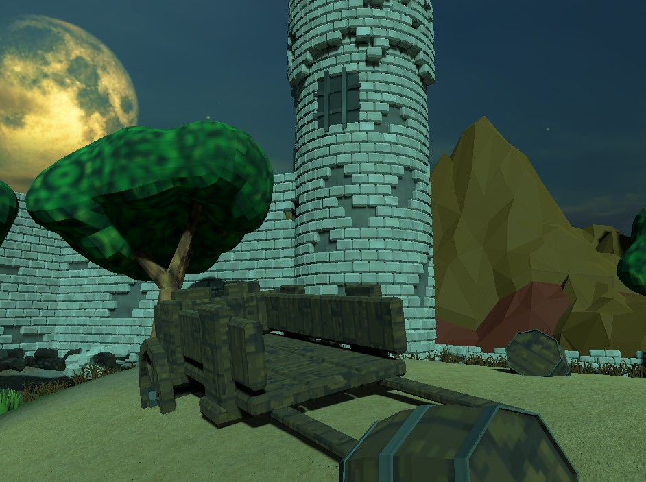

# Middle Ages

**Middle Ages** — это 3D экшен-игра с видом сверху, разработанная на Unity. Погрузитесь в мир средневековья, сражаясь с орками, магами и скелетами, прокачивая героя и улучшая оружие. 
Исследуйте опасные земли и сражайтесь за выживание в фэнтезийной вселенной!

## 🎮 Основные механики

- **3D мир с видом сверху**: Полный контроль над персонажем с удобным видом сверху, позволяющим эффективно сражаться и исследовать мир.
- **Эпичные битвы**: Сражения с орками, магами и скелетами, каждый тип врага требует особой стратегии и подхода.
- **Прокачка героя**: Улучшайте характеристики вашего персонажа, чтобы стать сильнее и справляться с более сложными врагами.
- **Средневековая тематика**: Погружение в атмосферу средневековья с древними замками и таинственными лесами.

## ⌨️ Управление

- **W, A, S, D**: Движение персонажа
- **Левая кнопка мыши**: Атака

## 💻 Системные требования

- **Операционная система**: Windows 10 или выше
- **Процессор**: Intel Core i3 или эквивалент
- **Оперативная память**: 4 GB RAM
- **Место на диске**: 400 MB свободного пространства

## 📝 Лицензия

Middle Ages — это собственная разработка и использует все соответствующие авторские права и лицензии.
